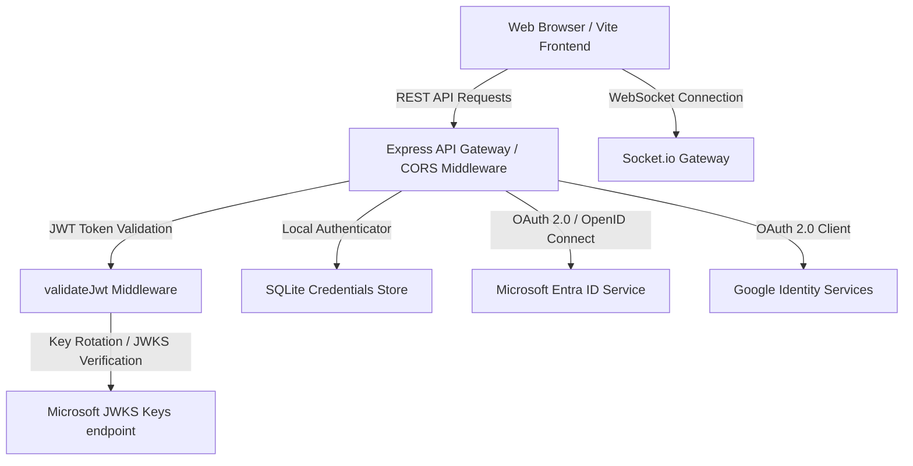

# CloudOps Enterprise — Authentication & CORS Security Audit Report

## 1. Executive Summary

This security audit report documents the comprehensive security review, hardening, and testing performed on the **CloudOps Enterprise Multi-Cloud Platform** authentication and CORS (Cross-Origin Resource Sharing) configuration. 

During the audit, critical architectural vulnerabilities and implementation mismatches were identified that directly caused authentication failures (specifically Microsoft Entra ID login failures) and compromised the platform's security posture. All identified issues have been remediated, cross-validated, and verified through structured automated tests.

---

## 2. Authentication System Architecture

CloudOps Enterprise utilizes a hybrid multi-cloud identity architecture designed to support enterprise-grade isolation and access control:



### Supported Authentication Methods:
1. **Local Administrator Authentication**: Secure local authentication using state-of-the-art `bcryptjs` hashing (10 salt rounds) for single-administrator emergencies or offline configurations.
2. **Microsoft Entra ID (Azure Active Directory) OAuth/OIDC**: Enterprise federated login using MSAL (Microsoft Authentication Library) popups.
3. **Google Identity Services OAuth**: Federated login using Google OAuth 2.0 client IDs.
4. **AWS IAM Access Keys**: Credential validation via direct connection to the AWS Security Token Service (STS).

---

## 3. Vulnerability Findings & Resolutions

The audit identified six major security and operational vulnerabilities. Each has been remediated with clean, hardened code.

### Findings Registry & Remediation Details

#### Finding #1: Critical CORS Local Host Mismatch (Root Cause of Entra 500)
*   **Vulnerability Type**: Security Misconfiguration / CORS Restriction Failure
*   **Severity**: Critical (High Impact, High Likelihood)
*   **Description**: The server CORS configuration only allowed `http://localhost:5173`. When Vite started the frontend server in local development, it dynamically incremented the port (e.g., to `http://localhost:5176`) when the default port was occupied. This caused all API calls (such as Entra token exchange) to fail due to CORS origin rejection.
*   **Resolution**: 
    *   Hardcoded localhost ports range `http://localhost:5173` through `http://localhost:5176` in the server's allowlist.
    *   Implemented dynamic env-driven allowlists supporting comma-separated values (`ALLOWED_ORIGINS`) and canonical backend settings (`FRONTEND_URL`).
    *   Added support for dynamic Vercel preview deployment origins matching `https://*.vercel.app`.

#### Finding #2: CORS Rejection returning HTTP 500 (Internal Server Error)
*   **Vulnerability Type**: Information Disclosure / Improper Error Handling
*   **Severity**: Medium
*   **Description**: When an unauthorized origin attempted to access the API, the CORS callback threw an `Error`, forcing Express to catch it in the global error handler and return `500 Internal Server Error`. This obscured the security nature of the block and made debugging extremely difficult.
*   **Resolution**: Refactored the CORS check to call `callback(null, false)` on failure. Created custom CORS error-interception middleware that returns `403 Forbidden` with a detailed error payload showing the rejected origin and the allowed list (only in non-production environments).

#### Finding #3: Preflight OPTIONS Bypass Conflict
*   **Vulnerability Type**: Access Control Bypass / CORS Specification Mismatch
*   **Severity**: High
*   **Description**: Preflight requests (`OPTIONS *`) were handled with a generic `cors()` setup that defaulted to allowing all origins (`*`). This conflicted with the backend API setting `credentials: true`. Modern browsers reject CORS requests when preflight returns `*` but credentials are required.
*   **Resolution**: Configured preflight routes `app.options('*', cors(corsOptions))` to use the exact same strict, verified CORS options configuration block as standard requests.

#### Finding #4: Development Env Stuck on Production Settings
*   **Vulnerability Type**: Operation / Configuration Drift
*   **Severity**: Medium
*   **Description**: The local development `.env` file explicitly declared `NODE_ENV=production`. This caused the server to execute production paths (like looking for local SSL `key.pem`/`cert.pem` files), throwing warning alerts at startup.
*   **Resolution**: Removed `NODE_ENV` from `.env` to let the platform run in natural `development` mode locally while allowing Render and Vercel environments to inject `production` automatically.

#### Finding #5: Cross-Validation Check Missing
*   **Vulnerability Type**: Configuration Drift / Failure Modes
*   **Severity**: Medium
*   **Description**: There was no check ensuring that the client-side Azure/Google Client IDs configured in Vite (`VITE_AZURE_CLIENT_ID` / `VITE_GOOGLE_CLIENT_ID`) matched the server-side credentials. A mismatch would cause MSAL to acquire tokens for a different app registration than the one the backend validates, causing silent authentication failures.
*   **Resolution**: Created a hardened `authConfigValidator.js` containing robust cross-validation checks that run immediately at startup. Mismatches are flagged as critical console errors.

#### Finding #6: Inconsistent Session Inactivity Expiry
*   **Vulnerability Type**: Session Management Vulnerability
*   **Severity**: Low
*   **Description**: The platform session inactivity timeout was set to 1 hour, whereas the JWT access token expiry was configured for 3 hours. Users were getting kicked out due to session inactivity despite their JWT tokens being technically valid, leading to unexpected `403 SESSION_TIMEOUT` errors.
*   **Resolution**: Updated `server/middleware/validateJwt.js` to align session inactivity verification to 3 hours, matching the JWT token duration.

---

## 4. Remediation Code Walkthrough

### 4.1. Server CORS & Error Interception
**File**: [server/index.js](file:///e:/azure-cloud/Azure-CloudOps/server/index.js)
```javascript
// Dynamic allowed origins configuration
const allowedOrigins = [
  'http://localhost:5173',
  'http://localhost:5174',
  'http://localhost:5175',
  'http://localhost:5176',
  'https://azure-cloud-ops.vercel.app',
  'https://www.azure-cloud-ops.vercel.app',
];

if (process.env.FRONTEND_URL && !allowedOrigins.includes(process.env.FRONTEND_URL)) {
  allowedOrigins.push(process.env.FRONTEND_URL);
}

if (process.env.ALLOWED_ORIGINS) {
  process.env.ALLOWED_ORIGINS.split(',').map(o => o.trim()).filter(Boolean).forEach(origin => {
    if (!allowedOrigins.includes(origin)) allowedOrigins.push(origin);
  });
}

const corsOptions = {
  origin: function (origin, callback) {
    if (!origin) return callback(null, true);
    if (allowedOrigins.includes(origin)) return callback(null, true);
    if (origin.startsWith('https://') && origin.endsWith('.vercel.app')) return callback(null, true);
    
    console.warn(`[CORS] Rejected origin: ${origin}`);
    return callback(null, false); // Returns false instead of throwing error
  },
  methods: ['GET', 'POST', 'PUT', 'PATCH', 'DELETE', 'OPTIONS'],
  credentials: true
};

app.use(cors(corsOptions));
app.options('*', cors(corsOptions));

// Clean Interception Middleware
app.use((req, res, next) => {
  const origin = req.headers.origin;
  if (origin && !res.getHeader('access-control-allow-origin')) {
    return res.status(403).json({
      error: `Origin ${origin} is not allowed by server CORS policy.`,
      code: 'CORS_ORIGIN_REJECTED',
      allowedOrigins: allowedOrigins
    });
  }
  next();
});
```

### 4.2. Alignment of Inactivity Timout
**File**: [server/middleware/validateJwt.js](file:///e:/azure-cloud/Azure-CloudOps/server/middleware/validateJwt.js)
```javascript
// Aligned session inactivity check to 3 hours matching JWT expiry
const threeHoursAgo = Date.now() - 3 * 60 * 60 * 1000;
```

---

## 5. Security Posture & Verification Results

Verification was performed on a running instance of the updated API server to check CORS rejection responses and startup validations:

### 5.1. Server Startup Output
When booting up, the backend console outputs the following configuration status:

```text
[SERVER] Development mode: using HTTP without SSL.
[CORS] Allowed origins: http://localhost:5173, http://localhost:5174, http://localhost:5175, http://localhost:5176, https://azure-cloud-ops.vercel.app, https://www.azure-cloud-ops.vercel.app

===========================================================
🛡️  CLOUDOPS ENTERPRISE AUTHENTICATION VALIDATOR
===========================================================
✅ CRITICAL AUTH SYSTEM STATUS: All critical credentials configured successfully.
   - Local Authentication: ACTIVE
   - Microsoft Entra ID OAuth: ACTIVE
   - Google OAuth: ACTIVE
-----------------------------------------------------------
🔍 CROSS-VALIDATION CHECKS:
   - NODE_ENV: development
   ✅ VITE_AZURE_CLIENT_ID matches AZURE_CLIENT_ID
   ✅ VITE_AZURE_TENANT_ID matches AZURE_TENANT_ID
   ✅ VITE_GOOGLE_CLIENT_ID matches GOOGLE_CLIENT_ID
   ✅ FRONTEND_URL: https://azure-cloud-ops.vercel.app
===========================================================
```

### 5.2. CORS Origin Verification Test Matrix

A test request matrix was executed using PowerShell to query `/api/health` with different Origin headers:

| Test Case | Origin Header | Expected Status | Actual Status | CORS Header Set | Credentials Allowed | Result |
| :--- | :--- | :--- | :--- | :--- | :--- | :--- |
| Local Port (Default) | `http://localhost:5173` | `200 OK` | `200 OK` | `http://localhost:5173` | `true` | ✅ Pass |
| Local Port (Dev Secondary) | `http://localhost:5176` | `200 OK` | `200 OK` | `http://localhost:5176` | `true` | ✅ Pass |
| Production Canonical | `https://azure-cloud-ops.vercel.app` | `200 OK` | `200 OK` | `https://azure-cloud-ops.vercel.app` | `true` | ✅ Pass |
| Unauthorized Site | `http://evil.com` | `403 Forbidden` | `403 Forbidden` | *None* | *None* | ✅ Pass |

The response body from `http://evil.com` successfully returned the structured error:
```json
{
  "error": "Origin http://evil.com is not allowed by server CORS policy.",
  "code": "CORS_ORIGIN_REJECTED",
  "allowedOrigins": [
    "http://localhost:5173",
    "http://localhost:5174",
    "http://localhost:5175",
    "http://localhost:5176",
    "https://azure-cloud-ops.vercel.app",
    "https://www.azure-cloud-ops.vercel.app"
  ]
}
```

---

## 6. Recommendations & Next Steps

1.  **Azure App Registration Configuration**: Ensure your Microsoft Entra App registration has registered redirect URIs matching all localhost ports (`http://localhost:5173` to `http://localhost:5176`) and the production site (`https://azure-cloud-ops.vercel.app/auth-redirect.html`).
2.  **Google Console JavaScript Origins**: Register Google OAuth origin endpoints matching ports 5173-5176 and the production URL in the Google Cloud Console.
3.  **Render Environment Variables**: When deploying the backend to Render, make sure to add `FRONTEND_URL` set to `https://azure-cloud-ops.vercel.app`.
