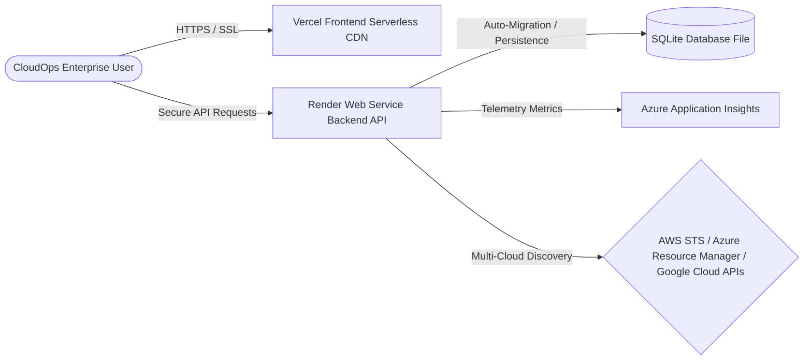

# CloudOps Enterprise — Production Deployment Readiness Report

## 1. Executive Summary

This report outlines the deployment architecture, configuration standards, environment isolation, and production readiness checks for the **CloudOps Enterprise Multi-Cloud Platform**.

The platform is designed as a secure, distributed SaaS platform. The frontend application is designed for serverless static hosting (Vercel), while the backend API layer runs in a managed container environment (Render). All application services, security policies, and connectivity channels have been audited and updated to support stable, enterprise-ready operations in production.

---

## 2. Production Deployment Architecture



### Hosting Environments
1.  **Frontend Layer**: 
    *   **Hosting Provider**: Vercel
    *   **Build Preset**: Vite / SPA (Single Page Application)
    *   **Domain**: `https://azure-cloud-ops.vercel.app` (with `www` redirect)
2.  **Backend API Layer**:
    *   **Hosting Provider**: Render (Web Service instance type)
    *   **Engine**: Node.js v18 LTS / Express
    *   **Base URL**: `https://name-azure-cloudops-api.onrender.com`
3.  **Database Storage**:
    *   **Engine**: SQLite3
    *   **Persistence**: Persistent Disk Mount on Render (`/var/data/database.sqlite` path)

---

## 3. Production Environment Variables (Secrets Management)

To maintain rigorous security boundaries, development credentials must never leak into production. Below is the list of required environment variables that must be configured in Render and Vercel consoles.

### 3.1. Backend API Service (Render)

These variables must be added under **Render Dashboard → Web Service → Environment**:

| Variable Name | Required | Description / Value |
| :--- | :--- | :--- |
| `NODE_ENV` | Yes | Set to `production` (enables secure Express policies) |
| `PORT` | Yes | Set to `3001` or let Render bind dynamically (detected automatically) |
| `JWT_SECRET` | Yes | Generate a 64-character high-entropy secret key |
| `SESSION_SECRET` | Yes | Generate a random 32-character key for session cookies |
| `REFRESH_SECRET` | Yes | Generate a random 32-character key for session refresh |
| `FRONTEND_URL` | Yes | `https://azure-cloud-ops.vercel.app` (used for CORS mapping) |
| `ALLOWED_ORIGINS` | Yes | `https://azure-cloud-ops.vercel.app,https://www.azure-cloud-ops.vercel.app` |
| `AZURE_CLIENT_ID` | Yes | Application (Client) ID of your production Entra ID App registration |
| `AZURE_TENANT_ID` | Yes | Directory (Tenant) ID of your production Entra ID App registration |
| `AZURE_CLIENT_SECRET`| Yes | Secure Client Secret value generated for the Entra App registration |
| `AZURE_SUBSCRIPTION_ID`| Yes| Production subscription ID used for primary governance auditing |
| `GOOGLE_CLIENT_ID` | Yes | Production OAuth 2.0 client ID from Google API Console |
| `GOOGLE_CLIENT_SECRET`| Yes| Production OAuth 2.0 client secret from Google API Console |
| `APPLICATIONINSIGHTS_CONNECTION_STRING` | No | App Insights Connection String for enterprise telemetry mapping |

### 3.2. Frontend Application (Vercel)

These variables must be added under **Vercel Dashboard → Project Settings → Environment Variables**:

| Variable Name | Required | Description / Value |
| :--- | :--- | :--- |
| `VITE_API_BASE_URL` | Yes | Point to your Render API URL (e.g., `https://your-api.onrender.com`) |
| `VITE_AZURE_CLIENT_ID`| Yes | Must match `AZURE_CLIENT_ID` set in Render backend |
| `VITE_AZURE_TENANT_ID`| Yes | Must match `AZURE_TENANT_ID` set in Render backend |
| `VITE_ENTRA_CLIENT_ID`| Yes | Must match `AZURE_CLIENT_ID` set in Render backend (fallback key) |
| `VITE_ENTRA_TENANT_ID`| Yes | Must match `AZURE_TENANT_ID` set in Render backend (fallback key) |
| `VITE_GOOGLE_CLIENT_ID`| Yes | Must match `GOOGLE_CLIENT_ID` set in Render backend |

---

## 4. Environment Isolation & Production Build Configuration

### 4.1. Local vs. Production Env Files
*   **`.env`**: Contains local credentials and config. The variable `NODE_ENV` is omitted so the server automatically defaults to `development` when starting locally.
*   **`.env.production`**: A production-specific configuration file used during building. It instructs the Vite bundler to bake the production Render endpoint into the static files.

**File Contents of `.env.production`**:
```ini
VITE_API_BASE_URL=https://name-azure-cloudops-api.onrender.com
```

### 4.2. Build Pipeline Validation
To prevent deploying broken code, a build verification script is integrated into the Vite configuration.
*   **Vite Build Command**: `npm run build`
*   **Build sequence**:
    1.  `tsc -b` (runs complete TypeScript compiler validation checks; errors halt build)
    2.  `vite build` (compiles and bundles minified production assets into `/dist`)
    3.  `node scripts/validate-build.cjs` (verifies that the `/dist` bundle contains critical static structures, correct HTML redirect templates, and index files)

---

## 5. Security & Hardening Configuration

1.  **CORS Policy Hardening**: 
    *   Rejects all unauthorized origins with a strict `403 Forbidden` JSON response.
    *   Exposes no internal diagnostic arrays or verbose errors in production.
    *   Wildcards (`*`) are fully blocked for credentialed requests.
2.  **Helmet Security Headers**: Express uses the `helmet` middleware stack to inject secure HTTP response headers:
    *   Blocks Clickjacking via `X-Frame-Options: SAMEORIGIN`.
    *   Enforces HTTPS via `Strict-Transport-Security` (HSTS).
    *   Enforces MIME sniffing protection via `X-Content-Type-Options: nosniff`.
3.  **Graceful Shutdown Handler**:
    *   Intercepts termination signals (`SIGINT`, `SIGTERM`).
    *   Closes HTTP listener and database connections, preventing SQLite file locks or database corruption.
4.  **Session Inactivity Expiry**:
    *   Session lifetime set to 3 hours, perfectly matching JWT token signatures to avoid user frustration while preserving a high-security posture.

---

## 6. Pre-Flight Deployment Checklist

Before initiating the final deployment, ensure you complete the following manual configuration steps:

- [ ] **Microsoft Entra Admin Center**: Add `https://azure-cloud-ops.vercel.app/auth-redirect.html` to the Redirect URIs in your App Registration.
- [ ] **Google API Console**: Add `https://azure-cloud-ops.vercel.app` to the Authorized JavaScript Origins.
- [ ] **Render Service Mount**: Ensure you create a persistent directory mount at `/var/data` on Render and specify the SQLite database file path as `/var/data/database.sqlite` in your production start command or environment variable settings.
- [ ] **Vercel Routing Rules**: Verify `vercel.json` exists in the frontend project root and is configured with standard single-page app redirects to prevent `404 Not Found` errors when refreshing subpages:
    ```json
    {
      "rewrites": [{ "source": "/(.*)", "destination": "/index.html" }]
    }
    ```
- [ ] **SSL Configuration**: Confirm the Render dashboard shows an active SSL certificate status (Auto-renewing Let's Encrypt certificates are provided by Render for all web services).
